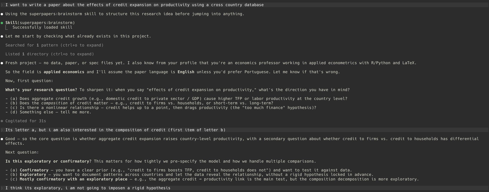

# Superpapers

A Claude Code plugin for empirical quantitative research — brainstorm, plan, and execute academic papers with the same discipline that Superpowers brings to software engineering.

Links:

- Live presentation: [superpapers](https://regisely.com/superpapers/)
- Example Paper: [credit_and_productivity_paper.pdf](https://regisely.com/superpapers/credit_and_productivity_paper.pdf)

## What It Is

Superpapers adapts the Superpowers pipeline (brainstorm → write-plan → execute-plan with subagent-driven development) for the full academic paper lifecycle. It covers everything from ideation to submission: literature search, data collection, statistical modeling, robustness checks, writing, and journal targeting. The pipeline is anchored by a `replication-driven-research` guardrail that replaces test-driven development in the research domain: every number, table, and figure in the paper must be regenerable from raw data by a script with a fixed seed.

The plugin is field-agnostic. Although it is inspired by applied economics and econometrics, the process and tooling work for any empirical quantitative field — political science, sociology, epidemiology, public health, environmental science, quantitative psychology, and more. Methods, data sources, and journal suggestions are not constrained to a fixed list; the plugin adapts to the research question.

Superpapers is a standalone plugin with no dependencies on Superpowers or any other Claude Code plugin. Plugin internals (skills, scripts, templates, comments) are English-only, but the plugin produces paper content (sections, tables, captions) in whatever language the user chooses for their paper.

## Installation

Add the plugin from GitHub in any Claude Code session:

```
/plugin marketplace add regisely/superpapers
/plugin install superpapers
```

Claude Code accepts a GitHub repo directly as the marketplace source. After installation, the skills become available automatically when you discuss research tasks.

## Updating

Claude Code caches marketplace repositories locally, so updating the plugin is a two-step process:

```
/plugin marketplace update superpapers
/plugin update superpapers
```

Use `/plugin marketplace update superpapers` to refresh the local clone of the marketplace repository, then `/plugin update superpapers` to reinstall the latest published plugin version from that refreshed marketplace state.

Optional project settings command:

```
/superpapers:init
```

This creates or updates `CLAUDE.superpapers.md` in the current project. You can run it at the start of a project or later, after brainstorm has already written a spec in `docs/superpapers/specs/`.

Explicit workflow commands:

```
/superpapers:brainstorm
/superpapers:write-plan
/superpapers:execute-plan
```

These commands are the superpapers-specific entry points for the main research workflow and avoid confusion with generic commands from other plugins.

<a id="demonstration"></a>
## Demonstration

The full walkthrough lives in the interactive presentation. It follows the same real Claude Code session from brainstorm to submission, including failed identification, pivot, robustness, and final manuscript formatting.

The demo is not a scripted toy example. It walks through a real Claude Code session in which:

- the project starts from a concrete empirical question;
- the first identification strategy looks plausible, then fails after estimation;
- the workflow pivots to a second strategy instead of forcing a weak result;
- null results, failed diagnostics, robustness checks, and reframing decisions stay explicit;
- the user remains in the loop for major research decisions.

Stages covered in the live presentation:

- Brainstorm: define the question, research mode, and contribution.
- Design: compare approaches, map data, and lock the identification strategy.
- Plan: expand the research into explicit phased tasks.
- Execute: collect, prepare, estimate, diagnose failure, pivot, and run robustness checks.
- Submit: format the manuscript and verify the submission checklist.

[Open the interactive presentation](https://regisely.github.io/superpapers/)



_Representative moment from a real session: the workflow starts from a concrete research question and asks follow up questions to structure the project before any implementation._

## Skills Overview

Fourteen skills organized by role:

| Skill | Role | Purpose |
|---|---|---|
| `brainstorm` | Orchestration | Socratic exploration of a research idea; produces a design spec |
| `write-plan` | Orchestration | Translates an approved spec into a phased research execution plan |
| `execute-plan` | Orchestration | Runs the plan phase by phase with subagents and two-stage review |
| `academic-baseline` | Foundation | Non-negotiable principles that govern all other skills |
| `replication-driven-research` | Foundation | End-to-end reproducibility guardrail (replaces TDD) |
| `compile-latex` | Foundation | Multi-pass LaTeX compilation with engine and bib detection |
| `literature-search` | Pipeline | Web-verified search across academic databases |
| `citation-management` | Pipeline | BibTeX management via CrossRef API (no Zotero needed) |
| `data-collection` | Pipeline | Data discovery, respectful collection, manifest documentation |
| `statistical-modeling` | Analysis | Open-ended modeling process with method-family references |
| `tables-and-figures` | Analysis | Publication-quality LaTeX tables and vector PDF figures |
| `robustness-checks` | Analysis | Design-appropriate canonical robustness checks |
| `journal-selection` | Submission | Field-agnostic journal matching with tier strategy |
| `journal-guidelines` | Submission | Parses instructions for authors, builds submission checklist |

## Typical Workflow

1. **Start a new project.** Optionally run `/superpapers:init` to create `CLAUDE.superpapers.md`, the project settings file. You can also skip it and start talking to Claude directly; the plugin can infer settings from context or ask when needed.
2. **Brainstorm.** Ask Claude Code something like "I want to study the effect of X on Y" or invoke `/superpapers:brainstorm`. The `brainstorm` skill activates and asks Socratic questions about your research question, identification strategy, data, and contribution. The output is a design spec saved inside the research project, typically under `docs/superpapers/specs/`. This spec is separate from `CLAUDE.superpapers.md`.
3. **Plan.** Once the spec is approved, invoke `/superpapers:write-plan` or continue naturally in the conversation. The `write-plan` skill generates a phased research plan (collection, preparation, analysis, robustness, writing, submission) with explicit artifacts and verification criteria per task, typically saved inside the research project under `docs/superpapers/plans/`.
4. **Execute.** Invoke `/superpapers:execute-plan` or continue naturally in the conversation. The `execute-plan` skill dispatches subagents per task, verifies after each phase, and runs the full pipeline end-to-end before declaring any result final.
5. **Submit.** When the paper is ready, use `journal-selection` to pick a target outlet and `journal-guidelines` to format the paper to that journal's requirements.

Throughout the workflow, `academic-baseline` enforces the non-negotiable principles and `replication-driven-research` guarantees the pipeline stays reproducible.

## Example Prompts

English:

```
I want to write a paper on the effect of wildfire smoke exposure on emergency room visits.
```

```
Help me find recent papers on incumbency advantage in mayoral elections, verified via DOI.
```

```
Run a staggered DiD on this panel of state-level policy adoptions from 2010 to 2024.
```

Skills activate automatically based on the conversation context — you do not need to invoke them by name.

## Project Setup

`CLAUDE.superpapers.md` is optional but recommended. It stores persistent project settings such as field, research question, paper language, significance convention, default seed, and target journals.

Recommended path:

```
/superpapers:init
```

The command creates or updates `CLAUDE.superpapers.md` in the project root. If you already have a brainstorm spec in `docs/superpapers/specs/`, it should pull settings from that spec and ask only for missing details.

Manual path:

- Copy `templates/CLAUDE.superpapers.md` into the project root and fill in the fields yourself.

If you skip this file entirely, superpapers still works. The skills fall back to project context and direct user instructions when settings are not persisted yet.

The canonical project structure — proposed by `replication-driven-research` on first invocation — is:

```
project-root/
├── data/
│   ├── raw/
│   ├── processed/
│   └── manifest.md
├── code/
├── output/
│   ├── tables/
│   ├── figures/
│   └── logs/
├── paper/
│   ├── paper.tex
│   └── references.bib
└── CLAUDE.superpapers.md
```

You can use `templates/paper-skeleton.tex` as a starting point for the paper itself and `templates/replication-readme.md` for the replication package.

## Language Policy

Plugin internals — SKILL.md files, scripts, templates, code comments, identifiers — are English-only. This keeps the plugin accessible to researchers globally.

Paper content — abstract, sections, table notes, figure captions, output strings — follows the user's chosen paper language. Set `paper_language` in `CLAUDE.superpapers.md` if you use the settings file, or state it explicitly in the conversation (default: `en`, options include `pt-BR`, `es`, `fr`, and so on). Skills that produce user-facing paper content respect this setting.

Your conversation with Claude Code can happen in any language. Only the plugin internals are fixed to English.

## License and Author

MIT License.

Author: Regis A. Ely (<regisaely@gmail.com>).

Issues and contributions: see the project homepage.
