# Superpapers

A Claude Code plugin for empirical quantitative research — brainstorm, plan, and execute academic papers with the same discipline that Superpowers brings to software engineering.

Links:

- Live presentation: [regisely.github.io/superpapers/](https://regisely.github.io/superpapers/)
- Example Paper: [regisely.github.io/superpapers/credit_and_productivity_paper.pdf](https://regisely.github.io/superpapers/credit_and_productivity_paper.pdf)

## What It Is

Superpapers adapts the Superpowers pipeline (brainstorm → write-plan → execute-plan with subagent-driven development) for the full academic paper lifecycle. It covers everything from ideation to submission: literature search, data collection, statistical modeling, robustness checks, writing, and journal targeting. The pipeline is anchored by a `replication-driven-research` guardrail that replaces test-driven development in the research domain: every number, table, and figure in the paper must be regenerable from raw data by a script with a fixed seed.

The plugin is field-agnostic. Although it is inspired by applied economics and econometrics, the process and tooling work for any empirical quantitative field — political science, sociology, epidemiology, public health, environmental science, quantitative psychology, and more. Methods, data sources, and journal suggestions are not constrained to a fixed list; the plugin adapts to the research question.

Superpapers is a standalone plugin with no dependencies on Superpowers or any other Claude Code plugin. Plugin internals (skills, scripts, templates, comments) are English-only, but the plugin produces paper content (sections, tables, captions) in whatever language the user chooses for their paper.

## Installation

Add the plugin from GitHub in any Claude Code session:

```
/plugin marketplace add regisely/superpapers
/plugin install superpapers
```

Claude Code accepts a GitHub repo directly as the marketplace source. After installation, the skills become available automatically when you discuss research tasks.

<a id="demonstration"></a>
## Demonstration

The walkthrough below follows the full research flow from brainstorm to submission in the same real Claude Code session.

The demo is not a scripted toy example. It walks through a real Claude Code session in which:

- the project starts from a concrete empirical question;
- the first identification strategy looks plausible, then fails after estimation;
- the workflow pivots to a second strategy instead of forcing a weak result;
- null results, failed diagnostics, robustness checks, and reframing decisions stay explicit;
- the user remains in the loop for major research decisions.

[Start the walkthrough](#demo-01) · [Brainstorm](#demo-01) · [Design](#demo-04) · [Plan](#demo-11) · [Execute](#demo-12) · [Submit](#demo-23)

<a id="demo-01"></a>
### 01. Brainstorm · The journey begins


_The journey begins: Claude asks for the research question._

[Back to top](#demonstration) | [Next →](#demo-02)

<a id="demo-02"></a>
### 02. Brainstorm · Research mode clarified

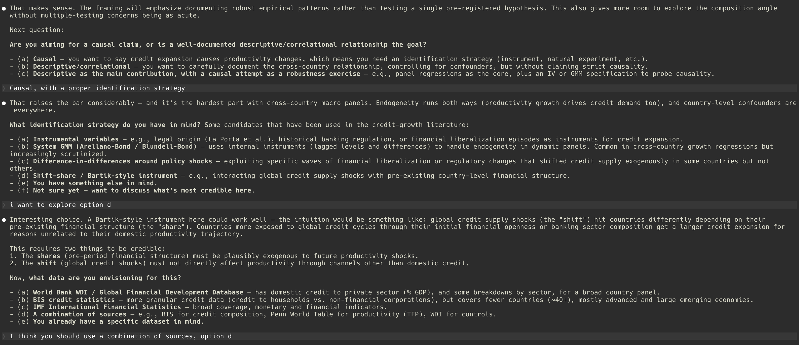

_Exploratory or confirmatory? Every downstream decision follows._

[← Previous](#demo-01) | [Back to top](#demonstration) | [Next →](#demo-03)

<a id="demo-03"></a>
### 03. Brainstorm · Contribution validated

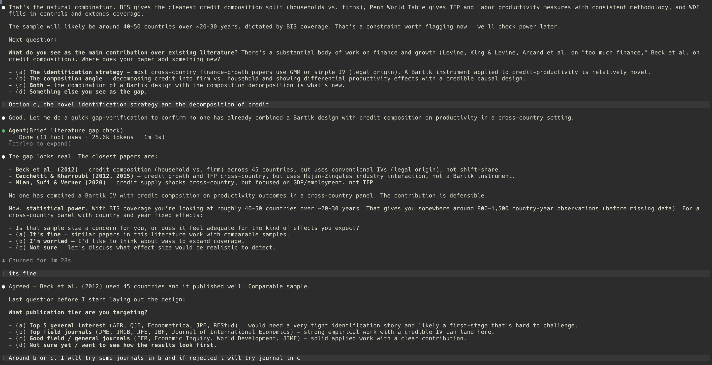

_Literature gap verified. Contribution is defensible._

[← Previous](#demo-02) | [Back to top](#demonstration) | [Next →](#demo-04)

<a id="demo-04"></a>
### 04. Design · Approaches compared

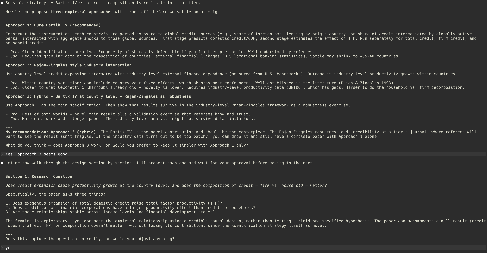

_Three approaches proposed with explicit trade-offs._

[← Previous](#demo-03) | [Back to top](#demonstration) | [Next →](#demo-05)

<a id="demo-05"></a>
### 05. Design · Data map locked

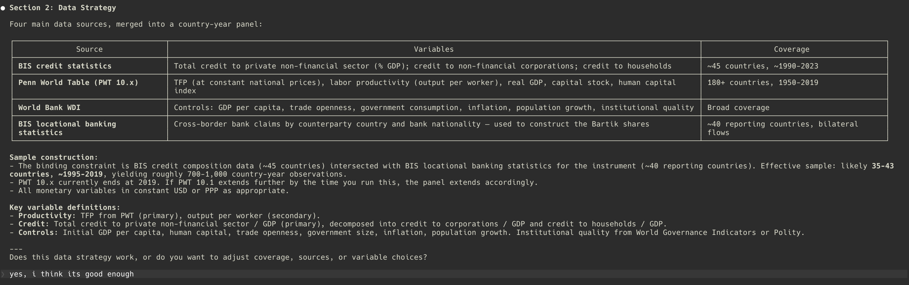

_Data sources mapped: BIS, Penn World Table, World Bank._

[← Previous](#demo-04) | [Back to top](#demonstration) | [Next →](#demo-06)

<a id="demo-06"></a>
### 06. Design · Identification strategy

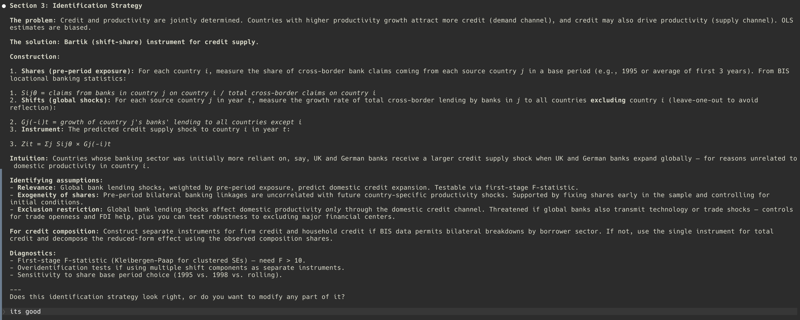

_Bartik shift-share instrument from cross-border banking flows._

[← Previous](#demo-05) | [Back to top](#demonstration) | [Next →](#demo-07)

<a id="demo-07"></a>
### 07. Design · Estimation path defined

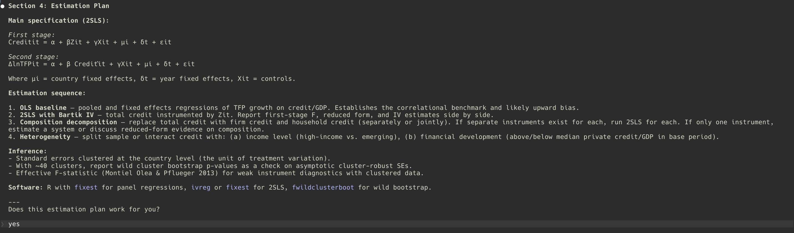

_Full estimation plan: OLS baseline, 2SLS, decomposition._

[← Previous](#demo-06) | [Back to top](#demonstration) | [Next →](#demo-08)

<a id="demo-08"></a>
### 08. Design · Outputs planned first

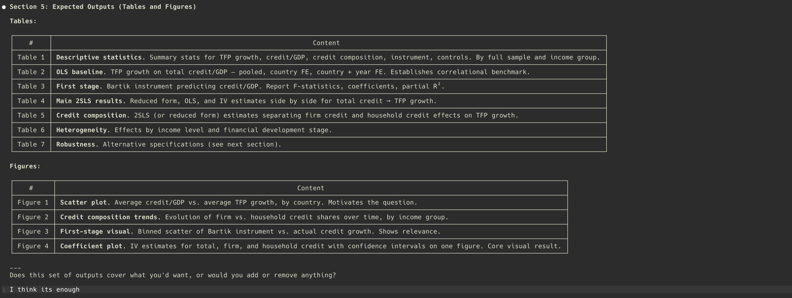

_Tables and figures planned before touching any data._

[← Previous](#demo-07) | [Back to top](#demonstration) | [Next →](#demo-09)

<a id="demo-09"></a>
### 09. Design · Robustness and journals

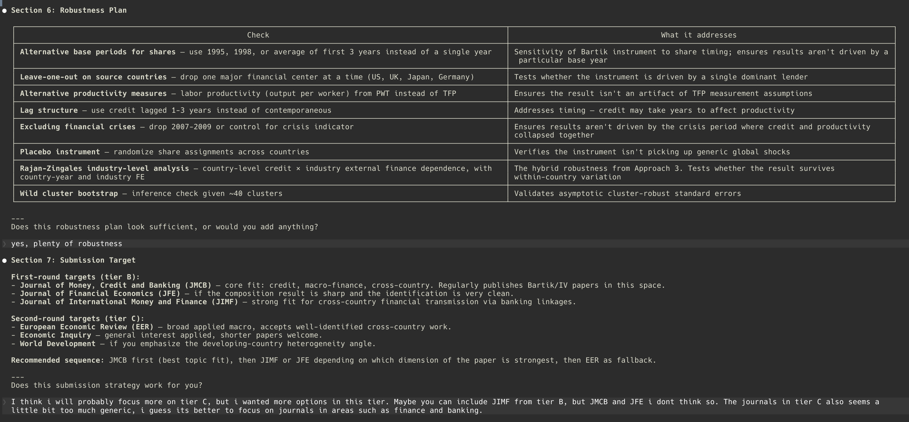

_Robustness checks and journal targets locked in upfront._

[← Previous](#demo-08) | [Back to top](#demonstration) | [Next →](#demo-10)

<a id="demo-10"></a>
### 10. Design · Spec committed

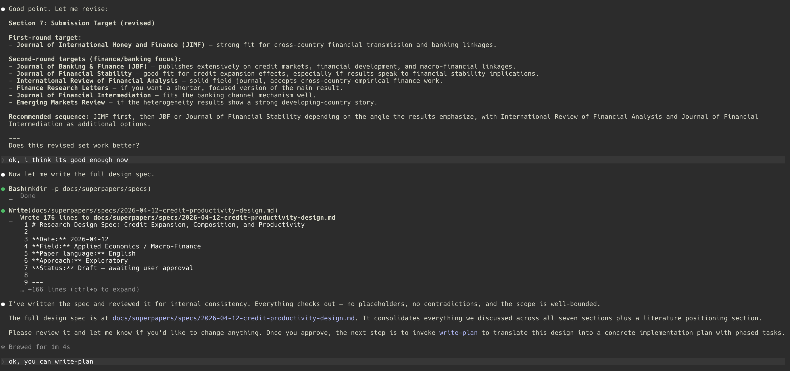

_Design spec written, reviewed, and committed._

[← Previous](#demo-09) | [Back to top](#demonstration) | [Next →](#demo-11)

<a id="demo-11"></a>
### 11. Plan · Execution plan expanded

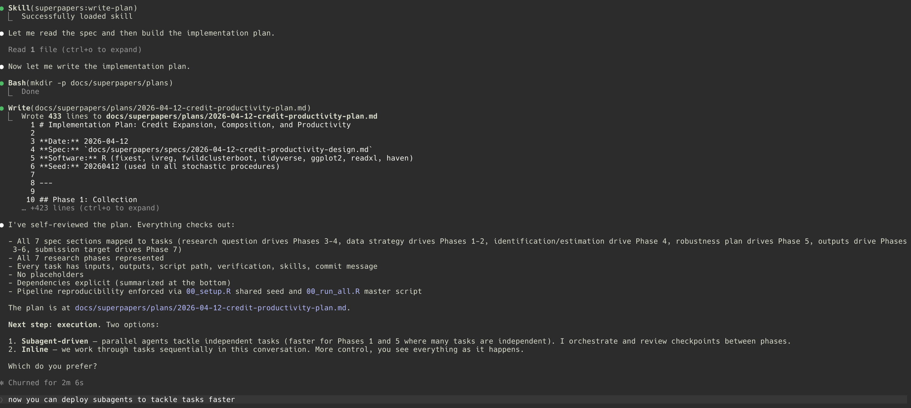

_Implementation plan: 30+ tasks across six research phases._

[← Previous](#demo-10) | [Back to top](#demonstration) | [Next →](#demo-12)

<a id="demo-12"></a>
### 12. Execute · Parallel execution begins

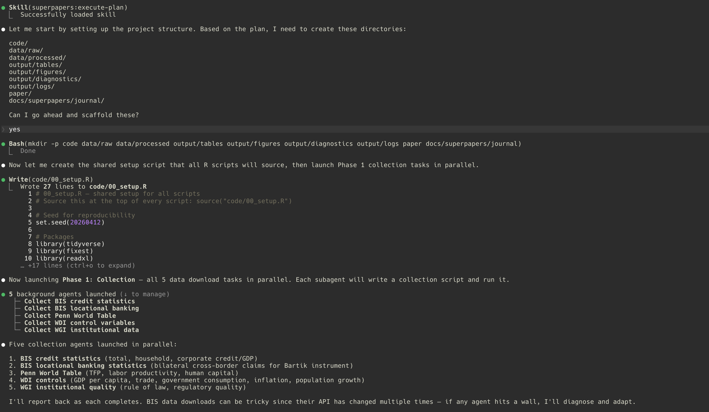

_Subagents dispatch in parallel. Data collection begins._

[← Previous](#demo-11) | [Back to top](#demonstration) | [Next →](#demo-13)

<a id="demo-13"></a>
### 13. Execute · Collection complete

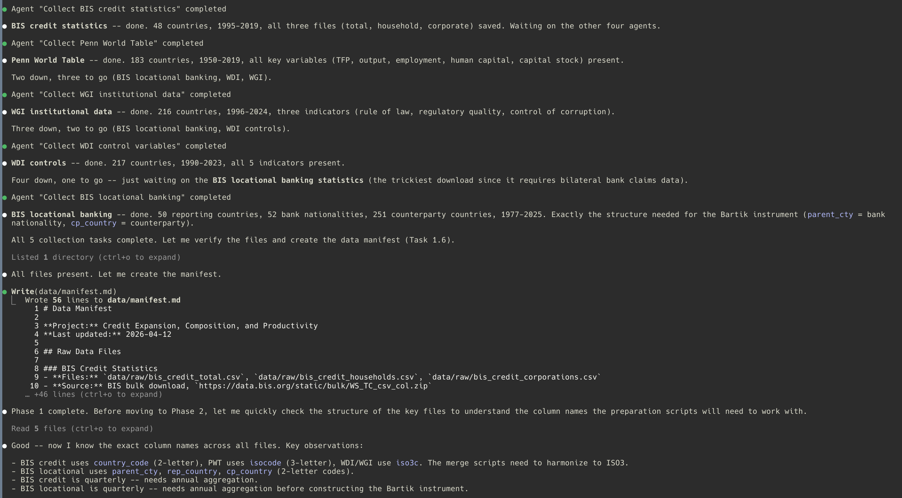

_Five collection tasks complete. The data manifest is written before preparation starts._

[← Previous](#demo-12) | [Back to top](#demonstration) | [Next →](#demo-14)

<a id="demo-14"></a>
### 14. Execute · Preparation complete

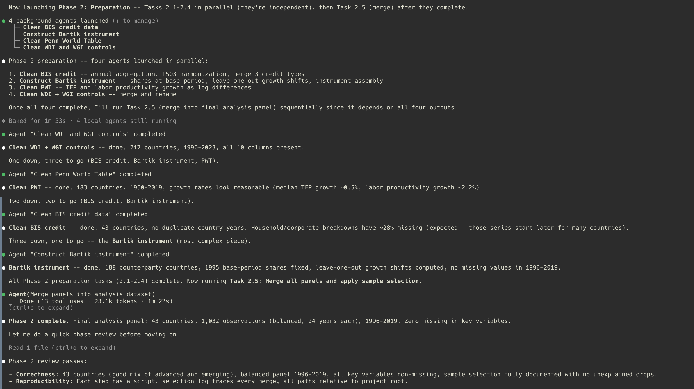

_Parallel cleaning and merging produce the final analysis panel._

[← Previous](#demo-13) | [Back to top](#demonstration) | [Next →](#demo-15)

<a id="demo-15"></a>
### 15. Execute · Exploratory outputs ready

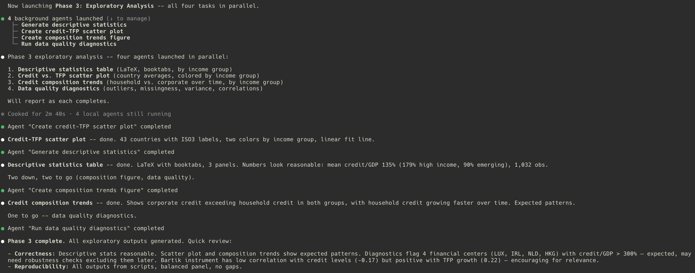

_Descriptives, scatter plot, composition trends, and diagnostics run in parallel._

[← Previous](#demo-14) | [Back to top](#demonstration) | [Next →](#demo-16)

<a id="demo-16"></a>
### 16. Execute · Main analysis challenged

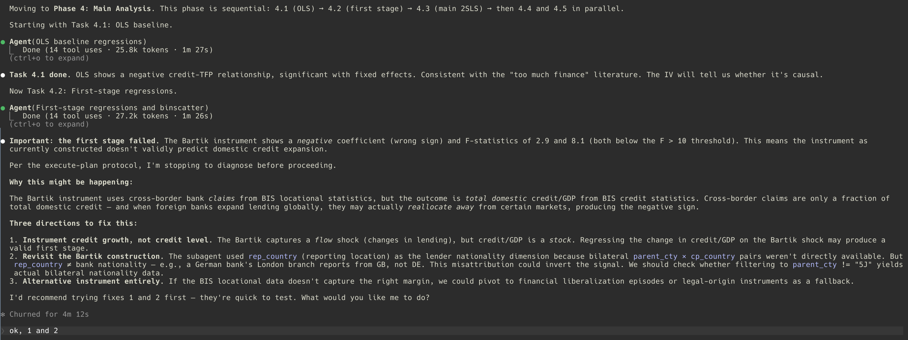

_Execution stops when the first stage fails. Diagnosis starts before moving on._

[← Previous](#demo-15) | [Back to top](#demonstration) | [Next →](#demo-17)

<a id="demo-17"></a>
### 17. Execute · Identification diagnosis

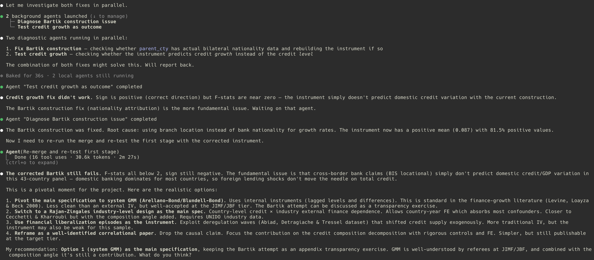

_Two diagnostic tracks run in parallel. The Bartik construction is fixed, but the first stage still fails._

[← Previous](#demo-16) | [Back to top](#demonstration) | [Next →](#demo-18)

<a id="demo-18"></a>
### 18. Execute · GMM pivot launched

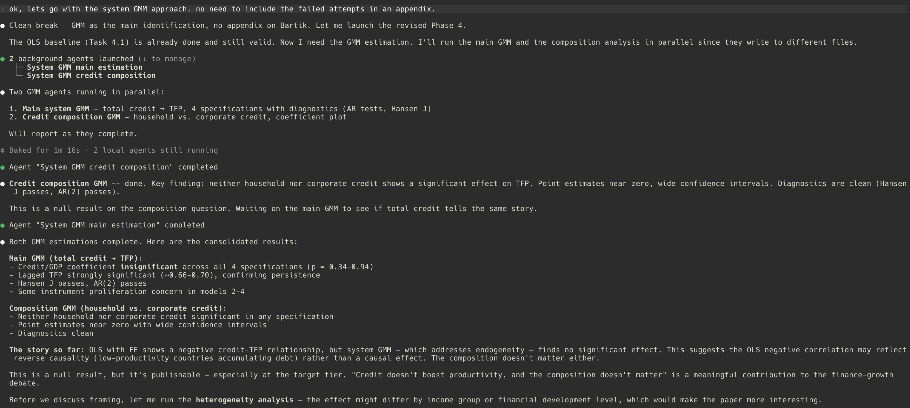

_The project pivots to system GMM, with main and composition estimations running in parallel._

[← Previous](#demo-17) | [Back to top](#demonstration) | [Next →](#demo-19)

<a id="demo-19"></a>
### 19. Execute · Results story consolidated

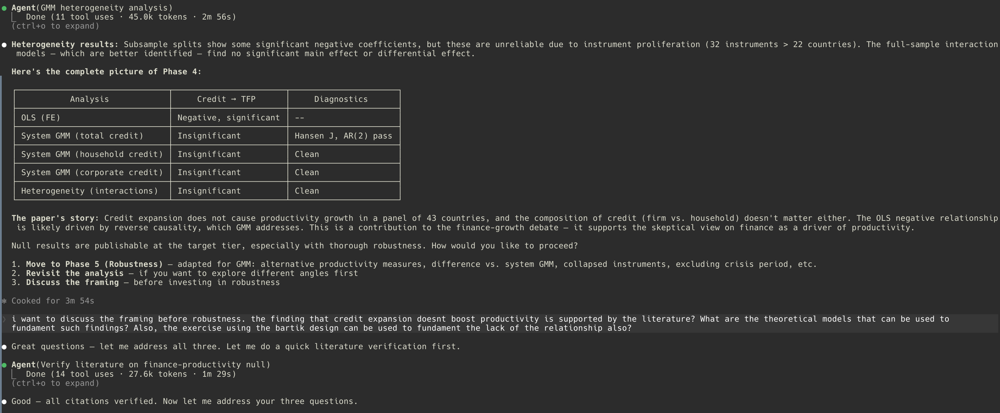

_Heterogeneity checks add no differential effect, and framing starts from a verified null result._

[← Previous](#demo-18) | [Back to top](#demonstration) | [Next →](#demo-20)

<a id="demo-20"></a>
### 20. Execute · Framing locked

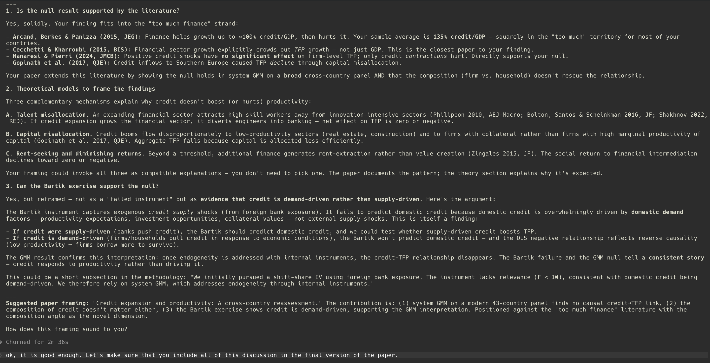

_The null result is grounded in literature, mechanisms, and a coherent paper narrative._

[← Previous](#demo-19) | [Back to top](#demonstration) | [Next →](#demo-21)

<a id="demo-21"></a>
### 21. Execute · Robustness in parallel

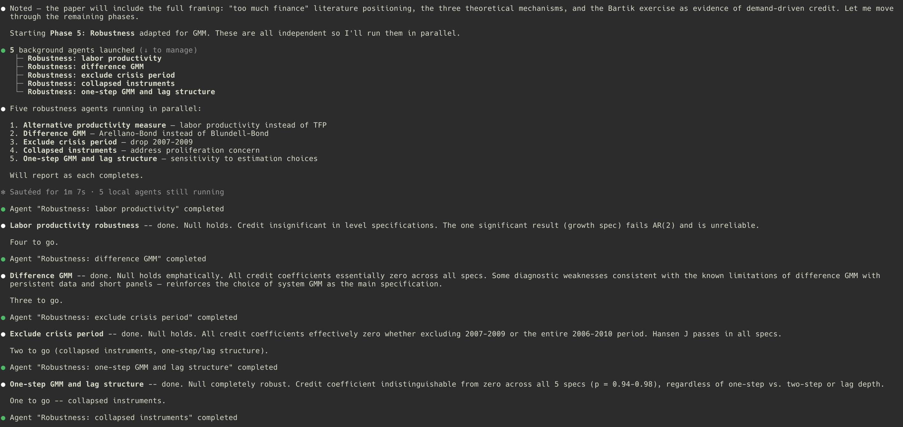

_Five robustness checks run in parallel and each one reinforces the null result._

[← Previous](#demo-20) | [Back to top](#demonstration) | [Next →](#demo-22)

<a id="demo-22"></a>
### 22. Execute · Writing starts cleanly

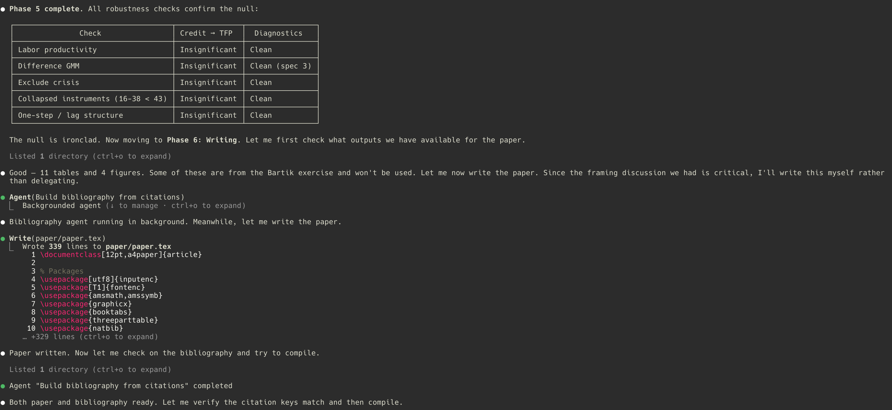

_Robustness closes cleanly, outputs are inventoried, and the paper draft starts from validated results._

[← Previous](#demo-21) | [Back to top](#demonstration) | [Next →](#demo-23)

<a id="demo-23"></a>
### 23. Submit · Submission formatting

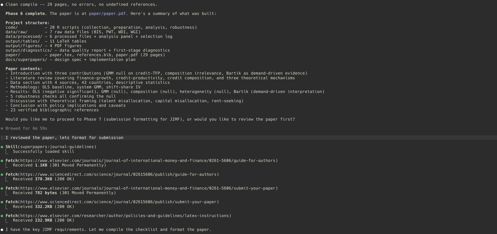

_Journal guidelines are fetched and the manuscript is formatted for the target outlet._

[← Previous](#demo-22) | [Back to top](#demonstration) | [Next →](#demo-24)

<a id="demo-24"></a>
### 24. Submit · Submission ready

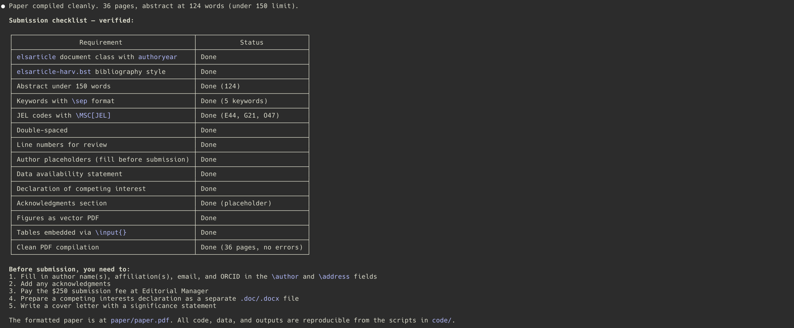

_A full submission checklist confirms the paper is formatted and ready for final author details._

[← Previous](#demo-23) | [Back to top](#demonstration)

## Skills Overview

Fourteen skills organized by role:

| Skill | Role | Purpose |
|---|---|---|
| `brainstorm` | Orchestration | Socratic exploration of a research idea; produces a design spec |
| `write-plan` | Orchestration | Translates an approved spec into a phased research execution plan |
| `execute-plan` | Orchestration | Runs the plan phase by phase with subagents and two-stage review |
| `academic-baseline` | Foundation | Non-negotiable principles that govern all other skills |
| `replication-driven-research` | Foundation | End-to-end reproducibility guardrail (replaces TDD) |
| `compile-latex` | Foundation | Multi-pass LaTeX compilation with engine and bib detection |
| `literature-search` | Pipeline | Web-verified search across academic databases |
| `citation-management` | Pipeline | BibTeX management via CrossRef API (no Zotero needed) |
| `data-collection` | Pipeline | Data discovery, respectful collection, manifest documentation |
| `statistical-modeling` | Analysis | Open-ended modeling process with method-family references |
| `tables-and-figures` | Analysis | Publication-quality LaTeX tables and vector PDF figures |
| `robustness-checks` | Analysis | Design-appropriate canonical robustness checks |
| `journal-selection` | Submission | Field-agnostic journal matching with tier strategy |
| `journal-guidelines` | Submission | Parses instructions for authors, builds submission checklist |

## Typical Workflow

1. **Start a new project.** Copy `templates/CLAUDE.superpapers.md` into your project root, fill in the research context (field, question, paper language, target journals).
2. **Brainstorm.** Ask Claude Code something like "I want to study the effect of X on Y". The `brainstorm` skill activates and asks Socratic questions about your research question, identification strategy, data, and contribution. The output is a design spec saved inside the research project, typically under `docs/superpapers/specs/`.
3. **Plan.** Once the spec is approved, the `write-plan` skill generates a phased research plan (collection, preparation, analysis, robustness, writing, submission) with explicit artifacts and verification criteria per task, typically saved inside the research project under `docs/superpapers/plans/`.
4. **Execute.** The `execute-plan` skill dispatches subagents per task, verifies after each phase, and runs the full pipeline end-to-end before declaring any result final.
5. **Submit.** When the paper is ready, use `journal-selection` to pick a target outlet and `journal-guidelines` to format the paper to that journal's requirements.

Throughout the workflow, `academic-baseline` enforces the non-negotiable principles and `replication-driven-research` guarantees the pipeline stays reproducible.

## Example Prompts

English:

```
I want to write a paper on the effect of Bolsa Família on child nutrition outcomes.
```

```
Help me find recent papers on minimum wage effects in Latin America, verified via DOI.
```

```
Run a staggered DiD on this panel of state-level policy adoptions from 2010 to 2024.
```

Skills activate automatically based on the conversation context — you do not need to invoke them by name.

## Project Setup

For new research projects, copy `templates/CLAUDE.superpapers.md` into the project root and fill in the fields (field, research question, paper language, default seed, target journals). This file tells Claude Code which skills apply to the project and what settings to respect.

The canonical project structure — proposed by `replication-driven-research` on first invocation — is:

```
project-root/
├── data/
│   ├── raw/
│   ├── processed/
│   └── manifest.md
├── code/
├── output/
│   ├── tables/
│   ├── figures/
│   └── logs/
├── paper/
│   ├── paper.tex
│   └── references.bib
└── CLAUDE.superpapers.md
```

You can use `templates/paper-skeleton.tex` as a starting point for the paper itself and `templates/replication-readme.md` for the replication package.

## Language Policy

Plugin internals — SKILL.md files, scripts, templates, code comments, identifiers — are English-only. This keeps the plugin accessible to researchers globally.

Paper content — abstract, sections, table notes, figure captions, output strings — follows the user's chosen paper language. Set `paper_language` in `CLAUDE.superpapers.md` (default: `en`, options include `pt-BR`, `es`, `fr`, and so on). Skills that produce user-facing paper content respect this setting.

Your conversation with Claude Code can happen in any language. Only the plugin internals are fixed to English.

## License and Author

MIT License.

Author: Regis A. Ely (<regisaely@gmail.com>).

Issues and contributions: see the project homepage.
